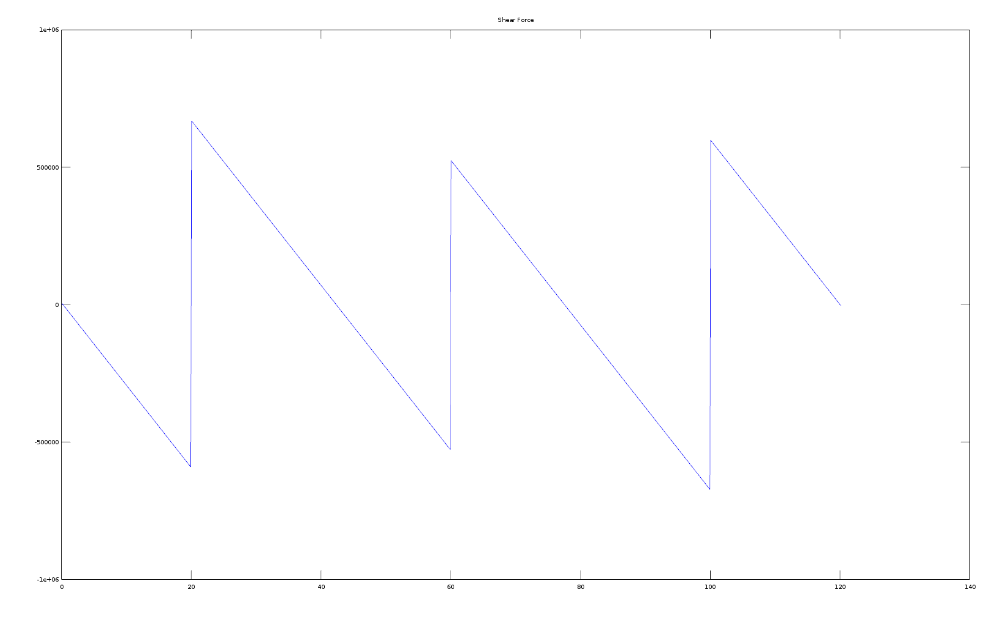
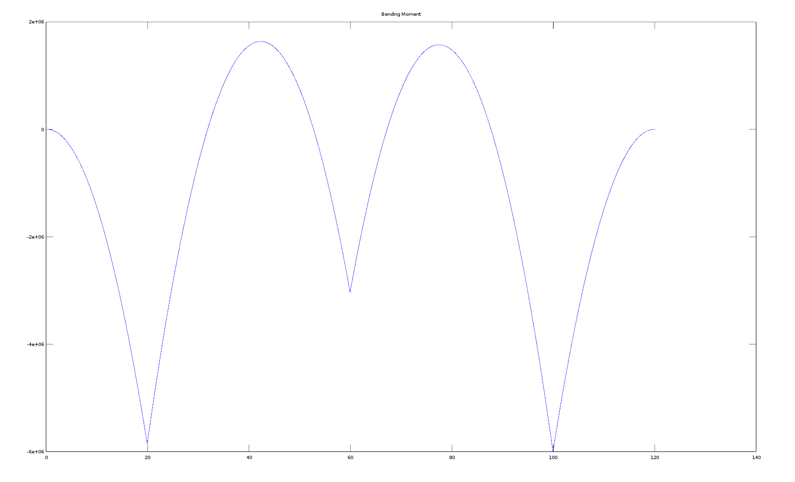
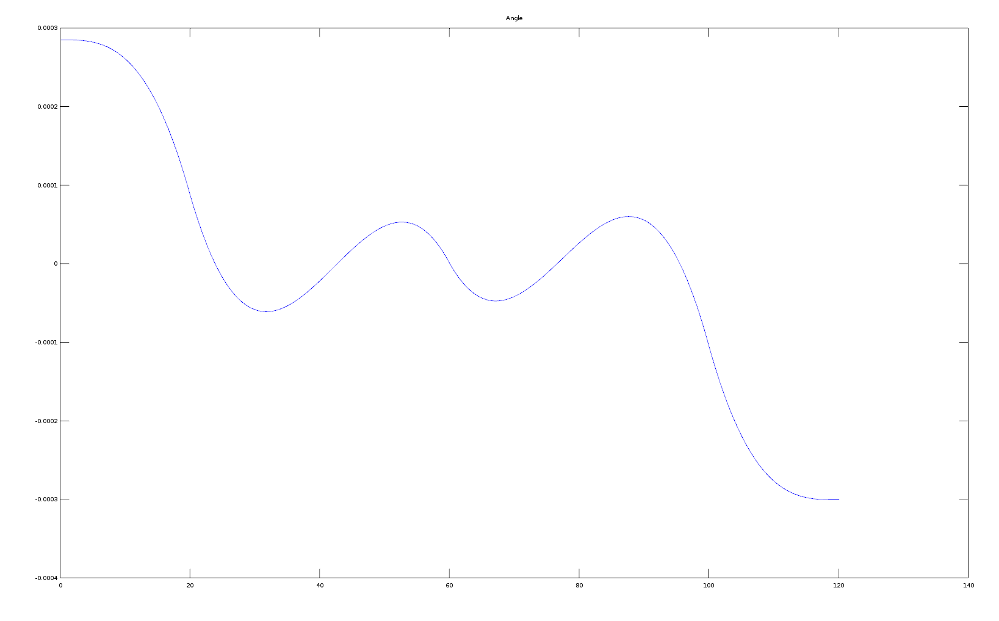
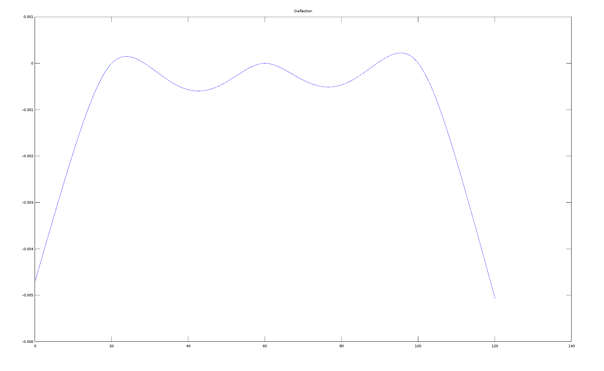

# beamAnalysis
Detailed analysis of a continuous beam.
Used to create plot for Bending Moment, Shear Force, Angle and Deflection for a beam.

Screenshots of Plots :-
### Shear Force

### Bending Moment

### Angle

### Deflection

